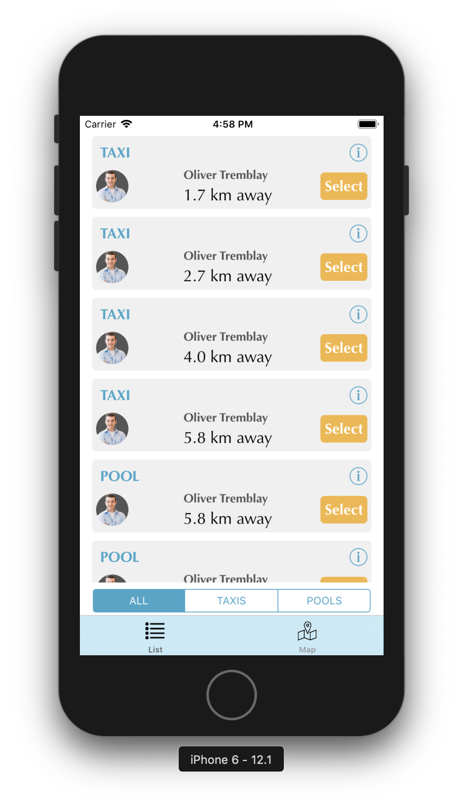
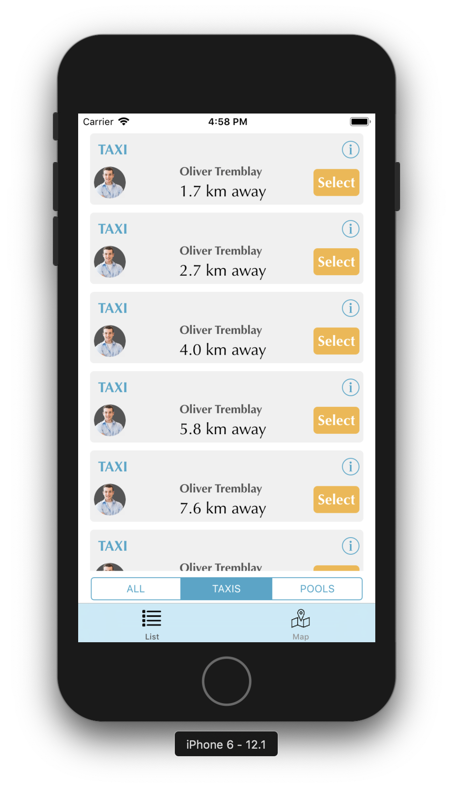
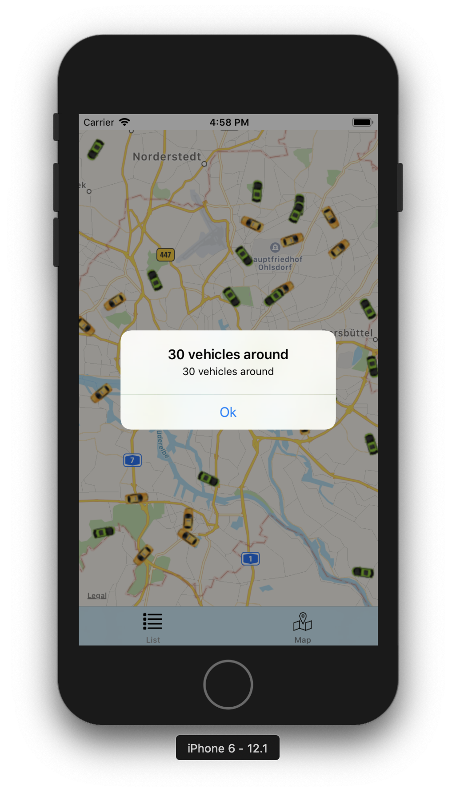
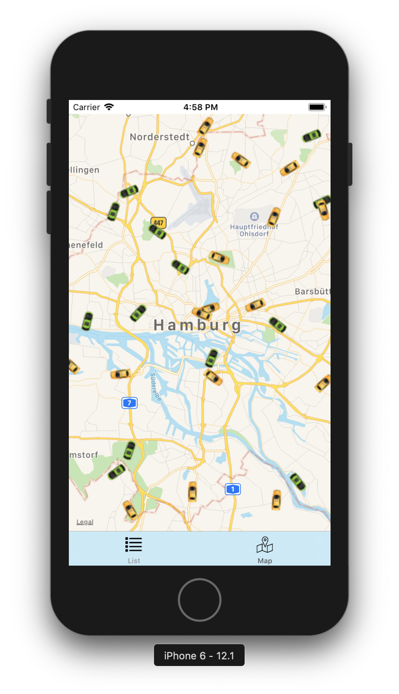
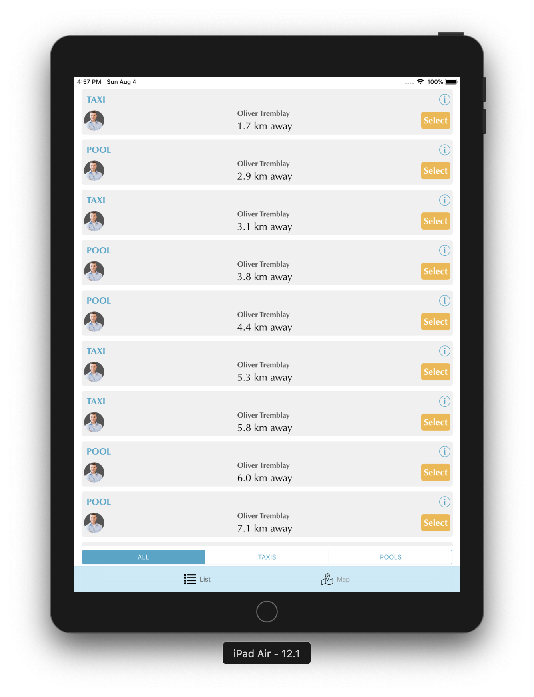

# DemoInteroperability
A sample app demonstrating **Objective-C** and **Swift** interoperability. Written in **MVVM design pattern**.

## Functional details:
The app covers following functionality:
* The app demostrates Objective C & Swift interoperability. Hence half the app is written in Swift and another half is written in Objective C.
* The app displays the vehicles in a scrollable list and in map.
* The app displays list of vehicles in screen 1 and then shows vehicles in a map in screen 2.
* The app downloads the list of vehicles from a web service.
* The app calculates the distance of each vehicle coordinates from Hamburg coordinates and shows the vehicle list sorted based on this distance.

## Implementation details:
Following are other implementation details of the project:
* Used MVVM design pattern.
* The app has 2 modules:
   * Module 1 - Vehicle list module
   * Module 2 - Vehicle map module
* Module 1 - vehicle list module is written in Swift and 
* Module 2 - vehicle map module is written in Objective C and both are interoperable.
* Have written some unit tests. 
* The app supports both iPhone and iPad.

## Design details:
* Have designed a highly scalable, maintanable and generic networking layer. 
* For implementing vehicle list API, I have written **Requests > VehiclesAPI API** which internally uses components from generic networking layer. For any further APIs required, we can write respective API in **Requests > NewAPI**. 
* For vehicle list module, have segregated dataSource also from VC. 
* Have kept minimum possible code in VCs and kept business logic separate from VCs.
* Considered Hamburg location (53.5511 and 9.9937) as reference location and many operations (showing vehicle distance and showing the vehicle in map from vehicle module) are wrt this Hamburg location.
* Have used structs and sub structs for storing constant values.
* Have used all Swift advanced features like **Protocols, Extensions, Structs and Generics**. Although some Swift specific features could not ne used extensively in order to maintain Objective C compatibility.
* Most of the basic classes (e.g. Utilities etc) are written in Swift so many @objc flags can be found to maintain the Objective C compatibility.
* Use of **functional programming concepts** (use of declarative function filter, reduce, map etc).
* Have used **protocol oriented approach** wherever possible. Have used protocols **AlertShowable** and **Progressable**.
* While writing this app, the focus was less on adding more and more features but was more on to write **scalable and maintainable code**.
* **.git folder** is there and can be used to overview progress and how the app has evolved.
* Followed mainly 4 design principles:
    * **S.O.L.I.D**
    * **Clean architecture**
    * **DRY** (Dont repeat yourself)
    * **POLA** (Principle of least astonishment)

## Screenshots
    
